<p align="center">
  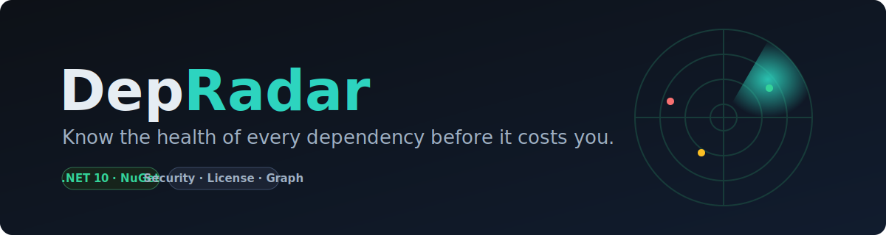
</p>

<h3 align="center">Know the health of every dependency before it costs you.</h3>

<p align="center">
  A dependency-health platform for .NET — it builds a project's full transitive graph,
  scores every package for <b>security, license, license-shift and maintenance</b> risk,
  and helps you <b>remediate, gate and monitor</b> it.
</p>

<p align="center">
  <a href="https://github.com/AdrianDeutsch/DepRadar/actions/workflows/ci.yml"></a>
  <a href="https://www.nuget.org/packages/DepRadar.Tool"></a>
  
  
  
  
</p>

<p align="center">
  <a href="#-quick-start">Quick start</a> ·
  <a href="#-features">Features</a> ·
  <a href="#-usage">Usage</a> ·
  <a href="#-architecture">Architecture</a> ·
  <a href="https://github.com/AdrianDeutsch/DepRadar/releases/latest">▶ Demo video</a>
</p>

---

## Overview

Teams discover **license changes** (MediatR, AutoMapper, MassTransit and FluentAssertions
all went commercial in 2025), **security advisories**, **abandoned packages** and
**breaking changes** far too late — usually at the next audit or incident.

DepRadar resolves the **full transitive dependency graph** of a NuGet, npm or PyPI package
or project, scores every node with an explainable risk model, and answers the question every
tech lead actually has: **"is this upgrade worth it — and how risky is it?"** It then lets
you **fix** the risky ones (in place or via a PR), **gate** them in CI, and **monitor** them
over time with alerts.

<p align="center">
  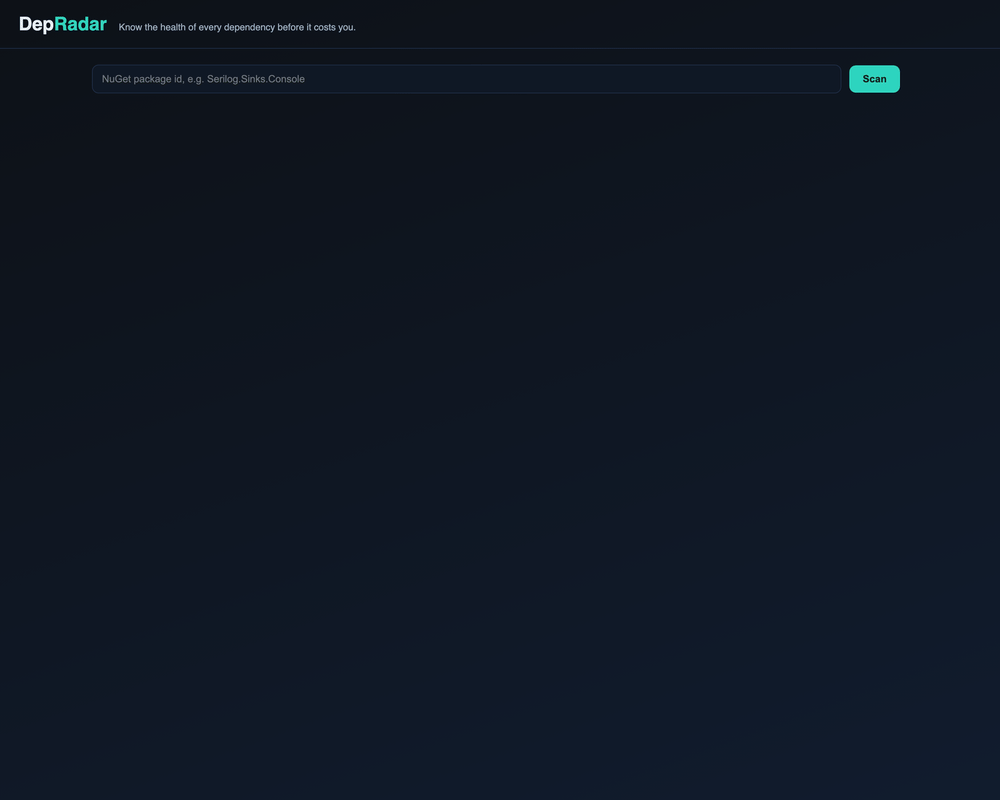
</p>
<p align="center"><sub><a href="https://github.com/AdrianDeutsch/DepRadar/releases/latest">▶ Watch the 15-second screencast</a> · landing → graph → risk &amp; remediation → upgrade diff → drift</sub></p>

<table>
  <tr>
    <td width="50%">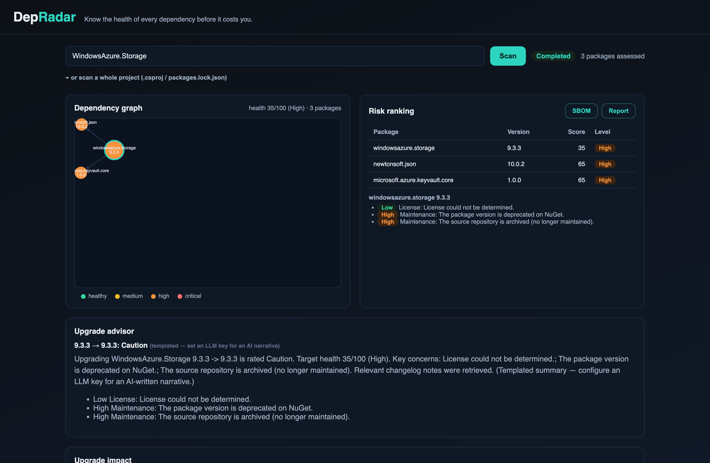</td>
    <td width="50%">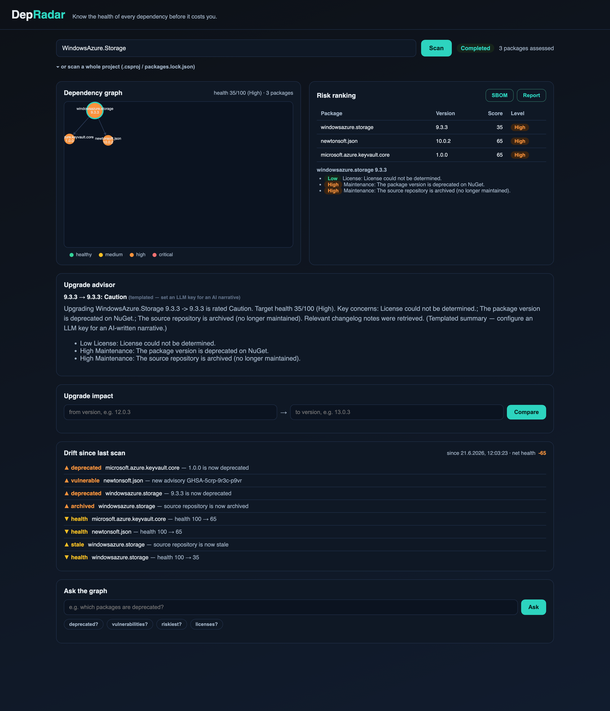</td>
  </tr>
  <tr>
    <td width="50%">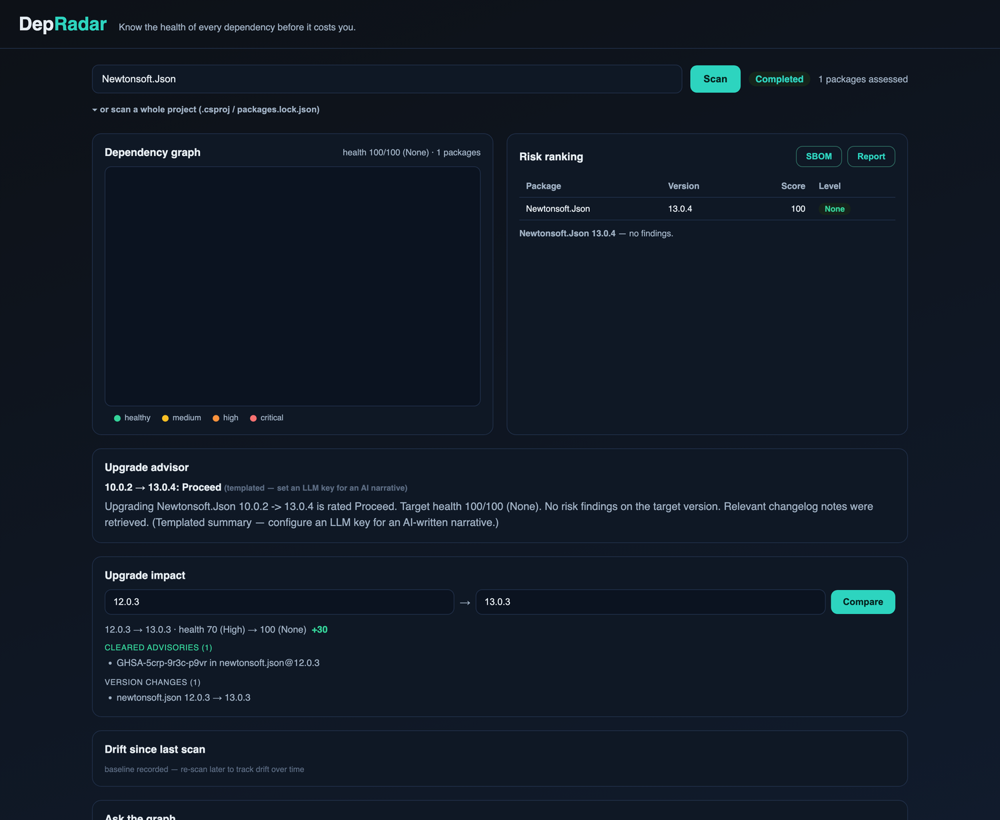</td>
    <td width="50%">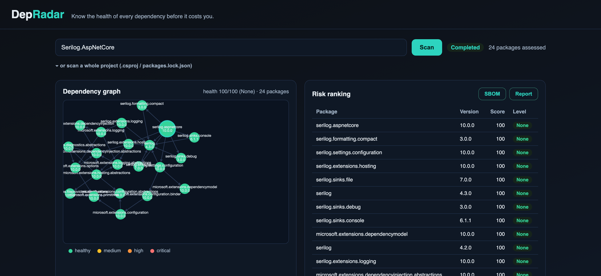</td>
  </tr>
</table>
<p align="center"><sub>Risk ranking with the vulnerability <b>path</b> + <b>fix</b> · drift since last scan · upgrade-impact diff · a healthy graph</sub></p>

---

## 🚀 Quick start

**Gate a build in 30 seconds** — the CLI runs the whole analysis in-process (no server, no
database):

```bash
dotnet tool install --global DepRadar.Tool

depradar scan WindowsAzure.Storage --fail-on high      # exit 1 fails CI on a policy breach
depradar npm express                                   # npm too
depradar pypi requests                                 # …and PyPI (Python)
depradar fix ./MyApp.csproj --open-pr --repo owner/name # auto-fix → opens a pull request
```

**Run the full platform** (dashboard, drift monitoring, REST API) with one command:

```bash
docker compose up --build      # then open http://localhost:8080
```

> [!NOTE]
> Compose starts PostgreSQL + pgvector, the API (migrates on startup) and the Worker
> (gated on the API being healthy). The pgvector extension is created up front, so there
> is no first-run ordering issue. Tear down with `docker compose down -v`.

---

## ✨ Features

#### 🔍 Analyze

- **Security scan** — known CVE/GHSA advisories per package version (OSV.dev).
- **License & license-shift** — flags SPDX changes and the OSS → commercial pivot (the "MediatR case").
- **Maintenance signals** — deprecated, archived or stale (last-commit) source repositories.
- **Transitive graph + health score** — an explainable score per package and per project.
- **Vulnerability paths** — for every vulnerable package, the chain that pulled it in (`root → A → B`).

#### 🛠️ Remediate

- **Minimal safe upgrade** — the smallest version that clears every advisory.
- **`depradar fix`** — applies it: patch the manifest in place, or **open a pull request** — for `.csproj`/props, `package.json` **and** `requirements.txt` ([ADR 0021]).
- **Transitive parent-bump** — bumps a direct dependency to the smallest version whose *whole graph* is clean.

#### 📡 Monitor

- **Drift over time** — every scan is snapshotted; surfaces what *rotted since you last looked*.
- **Autonomous watchlist** — re-scans tracked packages on a schedule (opt-in).
- **Multi-channel alerts** — Slack **and/or** GitHub issues, de-duplicated and **auto-closing** on recovery.
- **Drift digest** + **health/drift badges** + a `depradar.drift.open` **OpenTelemetry gauge**.

#### 🔌 Integrate

- **CLI + policy-as-code** — `depradar scan` as a `dotnet tool`; gate from a `depradar.json` in the repo.
- **GitHub Action** — a shift-left dependency gate that uploads SBOM + SARIF.
- **CycloneDX 1.5 SBOM** & **SARIF 2.1.0** — standards-based export; findings land in the **Security** tab.
- **Live dashboard** (SignalR), **Markdown audit report**, and a full **REST API** (`/scalar/v1`).
- **Edge hardening** — opt-in `X-API-Key` gate on `/api/*` + per-client rate limiting, both off by default ([ADR 0018]).

#### 🤖 AI &nbsp;·&nbsp; 🌐 Ecosystems

- **LLM upgrade advisor** — RAG over changelogs (pgvector) + a deterministic "ask the graph" chatbot. Prose comes from Claude when `ANTHROPIC_API_KEY` is set, else a templated fallback.
- **Prompt-injection defense** — changelogs are untrusted input; `PromptShield` fences them ([ADR 0006]).

> [!NOTE]
> Retrieval ships with a **keyless, deterministic hashing embedder** so RAG runs out of the box. It approximates *lexical* overlap, not meaning — register a hosted embedding model behind `IEmbeddingGenerator` for production-grade semantic search.
- **Multi-ecosystem** — scan **npm** and **PyPI** packages *or whole manifests* (`package.json`, `requirements.txt`) through the *same* Domain model, with ranges/PEP 440 specifiers resolved like the package managers do ([ADR 0020]).

---

## 🧭 Usage

### CLI

```bash
# Scan a package or a whole project; write SBOM + SARIF for CI
depradar scan WindowsAzure.Storage --fail-on high --no-deprecated
depradar scan ./MyApp.csproj --forbid copyleft --sbom sbom.json --sarif results.sarif

# Compare two versions — added/removed deps + CVEs introduced or cleared
depradar diff Newtonsoft.Json 12.0.3 13.0.3

# Multi-ecosystem — npm and PyPI through the same risk model
depradar npm express "^4"                              # exact versions, ranges, or latest
depradar npm ./package.json --sarif results.sarif      # scan a whole manifest
depradar pypi requests 2.19.1 --fail-on high
depradar pypi ./requirements.txt --sbom sbom.json      # PEP 440 specifiers respected

# Auto-fix vulnerable dependencies (incl. transitive, via parent-bump)
depradar fix ./MyApp.csproj --dry-run                     # preview the bumps
depradar fix ./MyApp.csproj                                # patch in place
depradar fix ./MyApp.csproj --open-pr --repo owner/name    # open a PR (needs GITHUB_TOKEN)
depradar fix ./package.json --dry-run                      # npm: keeps your ^/~ operator
depradar fix ./requirements.txt                            # PyPI: rewrites == pins
```

Exit codes: `0` policy passed · `1` policy violated · `2` usage error.

### Policy-as-code

Keep the gate in the repo, not in CI flags. The CLI auto-detects `depradar.json` in the
working directory (or pass `--policy <path>`); it takes precedence over the flags:

```jsonc
{
  "failOn": "high",                       // none | low | medium | high | critical
  "allowDeprecated": false,
  "forbiddenLicenses": ["copyleft", "unknown"],
  "ignore": ["Some.Accepted.Package"]     // accepted risk (VEX-style): shown, but not failing the gate
}
```

### GitHub Action

The CLI ships as a composite [GitHub Action](action.yml). DepRadar **dogfoods it** —
[`dependency-health`](.github/workflows/depradar.yml) gates its own dependencies on every
push, uploads a CycloneDX SBOM artifact, and **publishes a SARIF report to the Security tab**.

```yaml
- uses: AdrianDeutsch/DepRadar@v1
  with:
    target: src/MyApp/MyApp.csproj   # a package id, .csproj, or packages.lock.json
    fail-on: high                    # none | low | medium | high | critical
    no-deprecated: true
    forbid: copyleft                 # comma-separated license categories
    sbom: sbom.json                  # optional CycloneDX export
    sarif: results.sarif             # optional SARIF for code scanning
- uses: github/codeql-action/upload-sarif@v3
  if: always()
  with:
    sarif_file: results.sarif
```

### Autonomous monitoring (opt-in)

Set a few config values and DepRadar watches your dependencies for you:

```jsonc
// appsettings / environment / Aspire parameters
"Watch":     { "IntervalHours": 24 },                           // re-scan tracked packages daily
"Digest":    { "IntervalHours": 24 },                           // deliver the drift digest to Slack daily
"Retention": { "IntervalHours": 6, "MaxSnapshotsPerRoot": 50 }, // bound drift history (defaults shown)
"Alerts": {
  "SlackWebhookUrl": "https://hooks.slack.com/services/…",      // optional channel
  "GitHubRepo": "owner/name"                                    // optional channel (uses GitHub:Token)
}
```

When a re-scan introduces a **new high-severity** issue, the alert fans out to every
configured channel. GitHub alerts **de-duplicate and auto-resolve**: one stable issue per
package — a repeat comments on the open issue, and a later clean scan **closes** it.

### Health & drift badges

<p align="center">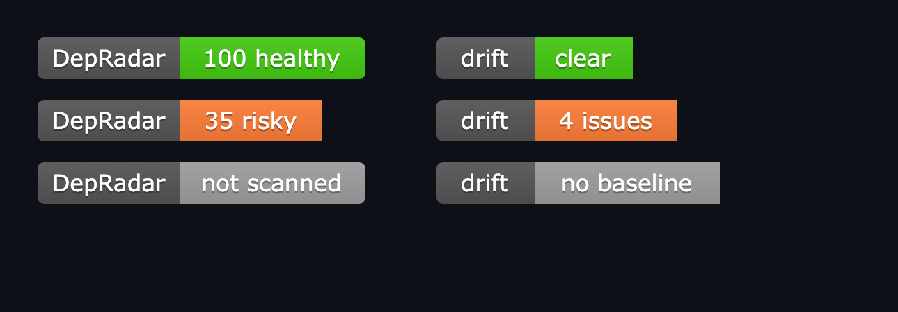</p>

```markdown


```

<details>
<summary><b>REST API reference</b> (the dashboard at <code>/</code> drives all of these)</summary>

```bash
# Queue a transitive scan (202 + scan id), then poll status
curl -X POST http://localhost:8080/api/packages/Serilog.Sinks.Console/scan
curl http://localhost:8080/api/scans/<scan-id>

# Graph, per-package risk, and the project-level rollup (worst first)
curl http://localhost:8080/api/packages/Serilog.Sinks.Console/graph
curl http://localhost:8080/api/packages/Serilog.Sinks.Console/risk
curl http://localhost:8080/api/packages/Serilog.Sinks.Console/graph/risk

# Why is a transitive package vulnerable, and what's the safe upgrade?
curl http://localhost:8080/api/packages/WindowsAzure.Storage/vulnerability-paths
curl http://localhost:8080/api/packages/WindowsAzure.Storage/remediation

# "Is this upgrade worth it?" — RAG over changelogs + risk
curl "http://localhost:8080/api/packages/Serilog.Sinks.Console/upgrade?from=5.0.0&to=6.0.0"

# Whole-project scan, audit-ready report, SBOM, SARIF, chat
curl -X POST http://localhost:8080/api/projects/scan -H "Content-Type: text/plain" --data-binary @MyApp.csproj
curl http://localhost:8080/api/packages/Serilog.Sinks.Console/report
curl http://localhost:8080/api/packages/Serilog.Sinks.Console/sbom
curl http://localhost:8080/api/packages/WindowsAzure.Storage/sarif
curl -X POST http://localhost:8080/api/packages/Serilog.Sinks.Console/chat \
  -H "Content-Type: application/json" -d '{"question":"which packages are unmaintained?"}'

# Version diff, drift, badges, and the cross-package digest
curl "http://localhost:8080/api/packages/Newtonsoft.Json/diff?from=12.0.3&to=13.0.3"
curl http://localhost:8080/api/packages/WindowsAzure.Storage/drift
curl http://localhost:8080/api/packages/Serilog.Sinks.Console/badge.svg
curl http://localhost:8080/api/drift/digest
```

The interactive API reference is served at `/scalar/v1`.

</details>

---

## 🏗️ Architecture

Clean Architecture with a strictly **inward** dependency direction, enforced in CI by
[NetArchTest](tests/DepRadar.Architecture.Tests). Decisions are recorded as ADRs in
[`docs/adr`](docs/adr).

<p align="center">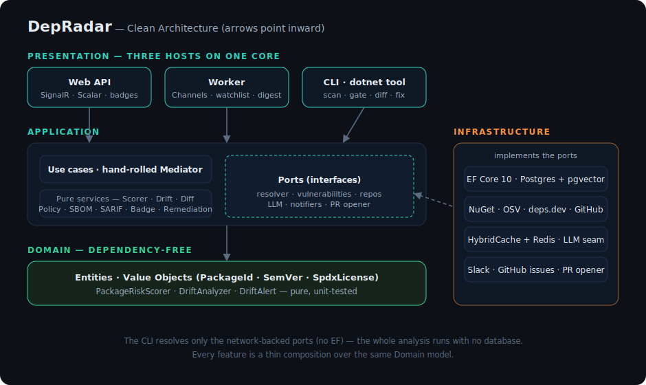</p>

The **CLI host** resolves only the network-backed ports (NuGet/OSV/GitHub) — never EF — so
it runs the whole analysis with no database. Every feature is a thin composition over the
same Domain model; the arrows only ever point inward.

<details>
<summary><b>Flow diagrams</b> — scan pipeline · drift monitoring · auto-fix</summary>

<br/>

**Async, durable scan pipeline**

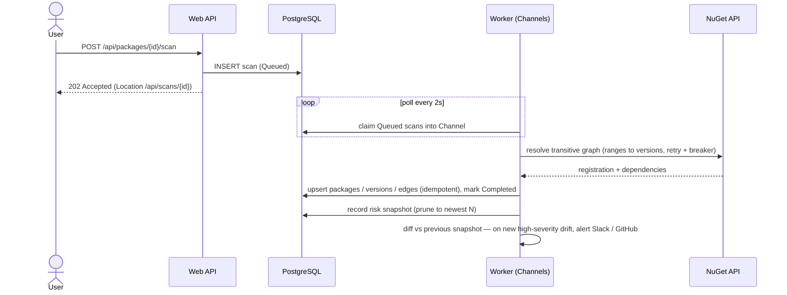

**Autonomous drift monitoring** (open on regression, close on recovery)

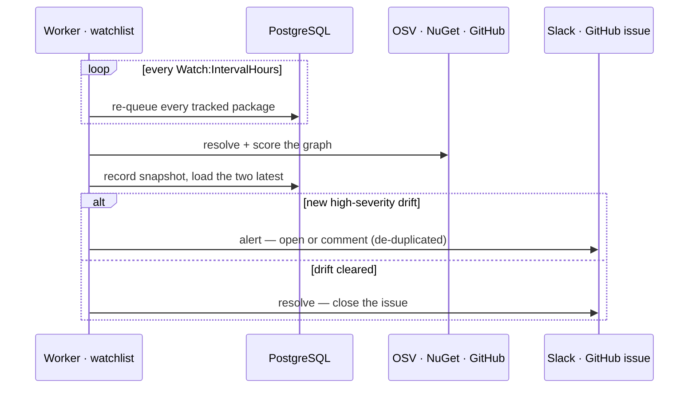

**Auto-fix** (minimal safe upgrade, incl. transitive parent-bump)

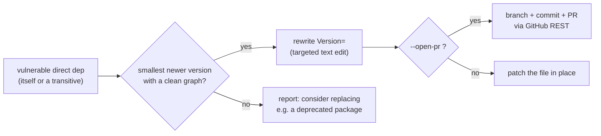

</details>

<details>
<summary><b>How it works</b> — the scan lifecycle, step by step</summary>

<br/>

1. `POST …/scan` creates a `Scan` row (`Queued`) and returns **202** — Postgres is the durable queue.
2. In the Worker, `System.Threading.Channels` decouples a DB **poller** from a **consumer** that runs each scan through the hand-rolled mediator.
3. The resolver walks NuGet registration metadata breadth-first, resolving each **version range to the concrete version** NuGet would install, bounded by a node cap.
4. Packages, versions and **dependency edges are upserted idempotently** — re-running a scan never duplicates rows.
5. Each node is scored: **OSV.dev** for advisories, license + deprecation from the NuGet catalog, and the root's **GitHub repo health**. A pure `PackageRiskScorer` turns these into explainable findings and an additive health score.
6. The graph (`recursive CTE`), risk rollup, **vulnerability paths** and **remediation** are read back over the API.
7. The **upgrade advisor** embeds the query, retrieves changelog chunks from **pgvector**, builds a prompt-injection-shielded prompt, and returns a deterministic recommendation + an LLM (or templated) narrative.
8. On completion the assessed graph is captured as an append-only **`jsonb` snapshot**. Comparing the two latest snapshots is **drift** — served at `…/drift`, digested at `/api/drift/digest`, and **alerted** to Slack/GitHub on new high-severity issues. An opt-in watchlist re-scans on a schedule.
9. The same Application core runs **standalone in the CLI** (no DB) to gate CI, and renders SBOM/SARIF/badges on demand.

**Prompt-injection defense.** Changelogs are attacker-controllable input. `PromptShield`
fences untrusted text in unique delimiters (stripping any occurrence of them), declares the
block to be *data, never instructions*, constrains the output, and **delegates no authority**
— the recommendation is computed deterministically; the LLM only writes the narrative. The
advisor works **keyless** (local embedder + templated narrative); set `Anthropic:ApiKey`
to enable the live Claude narrative ([ADR 0006]).

</details>

---

## 🧱 Tech stack

| Area          | Technology                                        | Purpose                                                              |
| ------------- | ------------------------------------------------- | ------------------------------------------------------------------- |
| Runtime       | .NET 10 (LTS) / C# 14                             | Long-term support; modern language features.                        |
| Web           | ASP.NET Core Minimal API + **SignalR**            | Thin HTTP surface; live scan progress to the dashboard.             |
| Pipeline      | Worker Service + `System.Threading.Channels`      | Ingestion, watchlist and scheduled digest, decoupled from the API.  |
| Persistence   | PostgreSQL + EF Core 10                           | Flat tables + recursive CTEs; `pgvector` for RAG; `jsonb` snapshots. |
| CQRS          | **Hand-rolled mediator** (MIT)                    | No commercially-licensed MediatR in the core ([ADR 0002]).          |
| AI / RAG      | **pgvector** + `ILanguageModel` seam (Claude)     | Keyless local embedder + RAG; Claude narrative behind a key ([ADR 0006]). |
| CLI           | `dotnet` global tool (`PackAsTool`)               | Stateless scan + policy gate for CI; no server, no database ([ADR 0009]). |
| Caching       | `HybridCache` (in-memory L1 + **Redis** L2)       | Keeps idempotent re-scans off the upstream API quota.               |
| Interop       | **CycloneDX 1.5** · **SARIF 2.1.0** · SVG badges  | Standards-based export; findings in GitHub code scanning.           |
| Alerts        | Slack webhook · GitHub issues (composite)         | Pluggable, multi-channel drift notifications ([ADR 0012]).          |
| Orchestration | .NET Aspire 13                                    | Wires API + Worker + Postgres + Redis + telemetry.                  |
| Resilience    | `Microsoft.Extensions.Http.Resilience`            | Retry, circuit breaker, timeout, rate limiter on every call.        |
| Observability | OpenTelemetry (via Aspire)                        | Traces, metrics, logs — incl. a `depradar.drift.open` gauge.        |

---

## ✅ Testing & quality

| Kind         | Tooling                                       | What it proves                                                            |
| ------------ | --------------------------------------------- | ------------------------------------------------------------------------ |
| Unit         | xUnit v3 + Shouldly                           | SemVer/npm-range/PEP 440 precedence, risk scoring, drift, prompt-injection shield. |
| Architecture | NetArchTest                                   | Layer boundaries hold; MediatR & NuGet.Versioning stay out of the core.  |
| Integration  | Testcontainers + **real PostgreSQL/pgvector** | Idempotent graph upserts, recursive-CTE closure, risk rollup, RAG, drift. |
| Resolver     | Canned registry + OSV HTTP fixtures           | npm/PyPI transitive BFS, range/PEP 440 matching, de-dup, CVE mapping — no network. |

CI collects coverage (floor-gated) and publishes **keyless SLSA build provenance** for the `.nupkg` ([ADR 0019]); verify a download with `gh attestation verify <file>.nupkg -R AdrianDeutsch/DepRadar`.

```bash
dotnet test          # unit + architecture + integration (needs Docker)
```

Quality gates: nullable reference types, `TreatWarningsAsErrors`,
`AnalysisLevel=latest-recommended` (with a few documented waivers), Central Package
Management, and a [CI pipeline](.github/workflows/ci.yml) running build, format check and
all tests. Production hardening ([ADR 0008]): resilience on every external call, HybridCache
(+ Redis), EF Core migrations validated against pgvector on every test run, a stale-scan
reaper, custom OpenTelemetry, and a DB health check.

> [!NOTE]
> **Docker 29:** the Testcontainers Ryuk reaper is incompatible with Docker 29; the test
> fixture disables it programmatically, so integration tests stay green.

---

## 🗺️ Roadmap

DepRadar was built in six vertical slices, then extended well beyond them.

<details>
<summary>Development milestones (all shipped)</summary>

<br/>

- [x] **Slice 1 — Skeleton:** package → deps.dev → Postgres → API, with Aspire + tests.
- [x] **Slice 2 — Transitive graph:** async durable scans, NuGet range resolution, Channels worker, recursive-CTE graph API.
- [x] **Slice 3 — Risk analysis:** OSV security scan, license + license-shift, maintenance signals, explainable scoring.
- [x] **Slice 4 — LLM layer:** changelog RAG over pgvector, upgrade advisor, an `ILanguageModel` seam, prompt-injection defense.
- [x] **Slice 5 — Presentation:** dashboard, SignalR live progress, Markdown audit report.
- [x] **Slice 6 — Hardening:** HybridCache, EF migrations, stale-scan reaper, OpenTelemetry, health check.
- [x] **Beyond:** whole-project scan, CycloneDX SBOM, graph chatbot, upgrade-impact diff, the **CLI + policy gate** ([ADR 0009]), and **drift history** ([ADR 0010]).
- [x] **Autonomous monitoring:** retention, watchlist, Slack alerts, health badge ([ADR 0011]).
- [x] **Multi-channel alerts & digest:** GitHub-issue channel + cross-package digest ([ADR 0012]).
- [x] **Full drift lifecycle:** auto-closing issues, retention job, drift badge, OpenTelemetry gauge.
- [x] **Explainable & exportable findings:** vulnerability paths + SARIF 2.1.0 ([ADR 0013]).
- [x] **Remediation & auto-fix:** minimal safe upgrade + `depradar fix` / PR ([ADR 0014]).
- [x] **Multi-ecosystem:** npm ([ADR 0016]) and PyPI ([ADR 0017]) support — the same Domain, a new adapter per registry.
- [x] **Production hardening:** opt-in API-key gate + rate limiting ([ADR 0018]), CI coverage floor-gate + keyless build provenance ([ADR 0019]), HTTP-fixture resolver tests, and graph-truncation surfacing.
- [x] **Manifest scanning:** `package.json` / `requirements.txt` as first-class scan targets, range-aware root resolution, OSV fixed-version hints for every ecosystem ([ADR 0020]).
- [x] **Multi-ecosystem auto-fix:** `depradar fix` bumps vulnerable npm ranges and PyPI `==` pins to the minimal clean version ([ADR 0021]).

</details>

---

## 📄 License & credits

Licensed under the [MIT License](LICENSE).

Data sources: [NuGet V3 API](https://api.nuget.org/v3/index.json) ·
[npm registry](https://registry.npmjs.org) · [PyPI JSON API](https://pypi.org/) ·
[deps.dev](https://deps.dev) · [OSV.dev](https://osv.dev) ·
[GitHub Advisory Database](https://github.com/advisories) ·
[SPDX License List](https://spdx.org/licenses/).

[ADR 0002]: docs/adr/0002-handrolled-mediator.md
[ADR 0006]: docs/adr/0006-llm-rag-and-injection-defense.md
[ADR 0008]: docs/adr/0008-production-hardening.md
[ADR 0009]: docs/adr/0009-stateless-analysis-cli-and-policy.md
[ADR 0010]: docs/adr/0010-scan-history-and-drift.md
[ADR 0011]: docs/adr/0011-autonomous-monitoring-and-badge.md
[ADR 0012]: docs/adr/0012-multi-channel-alerts-and-digest.md
[ADR 0013]: docs/adr/0013-explainable-and-exportable-findings.md
[ADR 0014]: docs/adr/0014-remediation-minimal-safe-upgrade.md
[ADR 0016]: docs/adr/0016-multi-ecosystem-npm.md
[ADR 0017]: docs/adr/0017-multi-ecosystem-pypi.md
[ADR 0020]: docs/adr/0020-manifest-scanning-and-ecosystem-cli.md
[ADR 0021]: docs/adr/0021-multi-ecosystem-autofix.md
[ADR 0018]: docs/adr/0018-api-edge-hardening.md
[ADR 0019]: docs/adr/0019-ci-coverage-gate-and-provenance.md
