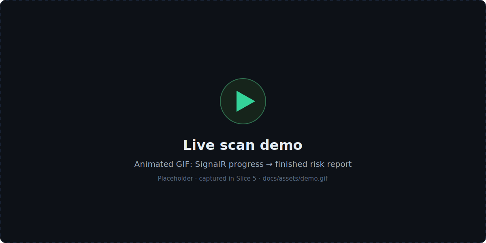
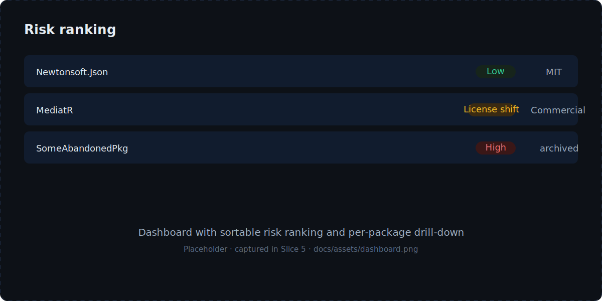
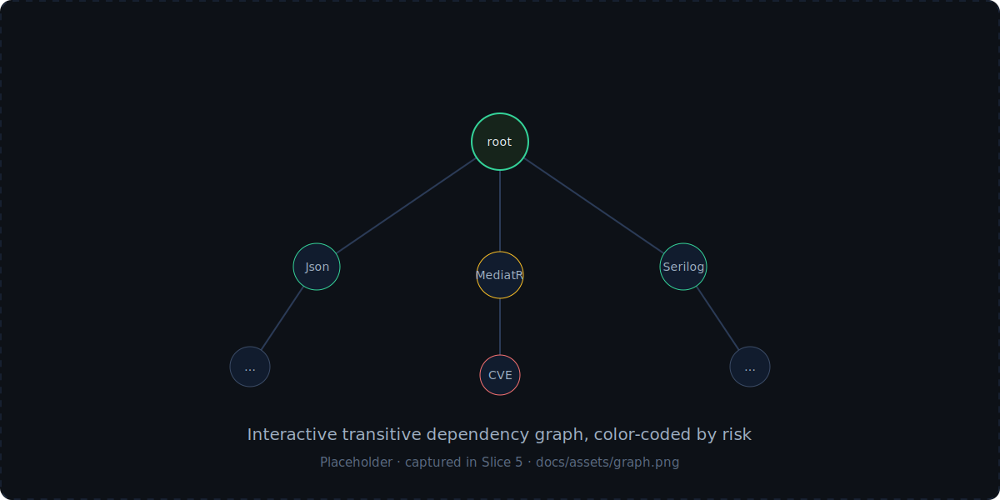
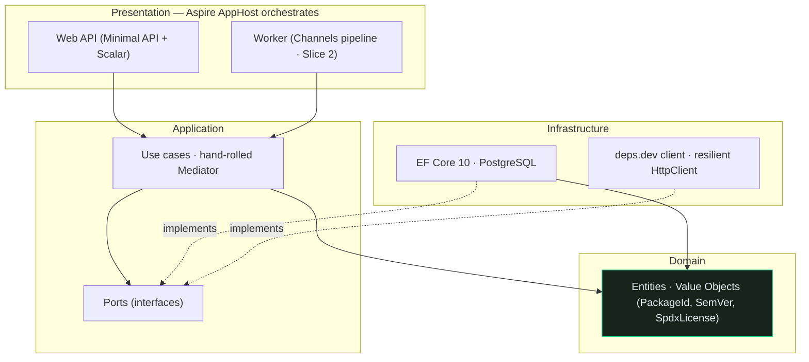
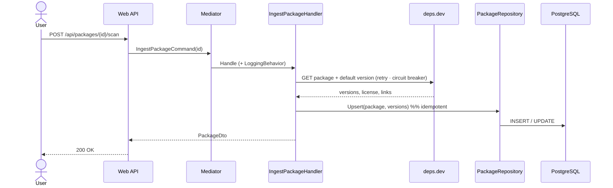

<p align="center">
  
</p>

<p align="center">
  <em>Know the health of every dependency before it costs you.</em>
</p>

<p align="center">
  <a href="https://github.com/AdrianDeutsch/DepRadar/actions/workflows/ci.yml"></a>
  
  
  
  
  
</p>

---

## Demo

<p align="center">
  
</p>

<table>
  <tr>
    <td width="50%"></td>
    <td width="50%"></td>
  </tr>
</table>

> The visuals above are placeholders. The animated scan demo and real screenshots
> are captured in Slice 5 — see [`docs/assets`](docs/assets/README.md).

## Problem & solution

Teams discover **license changes** (MediatR, AutoMapper, MassTransit and
FluentAssertions all went commercial in 2025), **security advisories**, **abandoned
packages** and **breaking changes** far too late — usually at the next audit or
incident. **DepRadar** builds the full (transitive) NuGet dependency graph of a
project, scores every dependency for security, license, maintenance and
license-model risk, and uses an LLM to answer the question every tech lead actually
has: **"Is this upgrade worth it — and how risky is it?"**

## Features

- 🔎 **Security scan** — resolves known CVE/GHSA advisories per package version.
- 📜 **License-shift detection** — flags SPDX license changes and the OSS → commercial
  pivot (the "MediatR case").
- 🕸️ **Transitive graph** — direct *and* transitive dependencies with resolved versions.
- 🧮 **Health scoring** — an explainable score per package and per project.
- 🤖 **LLM upgrade advisor** — RAG over changelogs + risk data, plus a graph chatbot.
- ⚡ **Live updates** — SignalR streams scan progress in real time.

> Slice 1 (this commit) ships the end-to-end skeleton: scan one package → resolve it
> via deps.dev → persist the graph in Postgres → read it back over the API. The
> feature list above is the target picture; see the [roadmap](#roadmap).

## Architecture

Clean Architecture with a strictly **inward** dependency direction, enforced in CI by
[NetArchTest](tests/DepRadar.Architecture.Tests). Decisions are recorded as ADRs in
[`docs/adr`](docs/adr).



Ingestion flow for a single package (Slice 1):



## Tech stack

| Area          | Technology                                   | Purpose                                                        |
| ------------- | -------------------------------------------- | ------------------------------------------------------------- |
| Runtime       | .NET 10 (LTS) / C# 14                         | Long-term support; modern language features.                  |
| Web           | ASP.NET Core Minimal API + SignalR (Slice 5) | Thin HTTP surface; live scan progress.                        |
| Pipeline      | Worker Service + `System.Threading.Channels` | Ingestion decoupled from the API (Slice 2).                   |
| Persistence   | PostgreSQL + EF Core 10                       | Graph as flat tables + recursive CTEs; `pgvector` for RAG.    |
| CQRS          | **Hand-rolled mediator** (MIT)               | No commercially-licensed MediatR in the core ([ADR 0002]).    |
| AI            | Microsoft Semantic Kernel (Slice 4)          | Changelog summaries, risk assessment, graph chat.             |
| Orchestration | .NET Aspire 13                               | Wires API + Worker + Postgres + telemetry.                    |
| Resilience    | `Microsoft.Extensions.Http.Resilience`       | Retry, circuit breaker, timeout, rate limiter on every call.  |
| Observability | OpenTelemetry (via Aspire)                   | Traces, metrics, logs.                                        |

## Getting started

**Prerequisites**

- [.NET 10 SDK](https://dotnet.microsoft.com/download) (`10.0.103` pinned in `global.json`)
- Docker Desktop (for the Aspire-orchestrated Postgres and for Testcontainers)

**Run the whole system with one command**

```bash
dotnet run --project src/DepRadar.AppHost
```

This launches the Aspire dashboard, PostgreSQL (+ pgAdmin), the Web API and the
Worker. Open the dashboard, find the **api** endpoint, then:

```bash
# Scan a package (resolves via deps.dev and stores the graph)
curl -X POST http://localhost:<api-port>/api/packages/Newtonsoft.Json/scan

# Read it back
curl http://localhost:<api-port>/api/packages/Newtonsoft.Json
```

The interactive API reference is at `/scalar/v1`.

> **Secrets** belong in User Secrets / environment variables / Aspire parameters —
> never in the repo. Slice 1 needs none (deps.dev is keyless); the GitHub token and
> LLM key are introduced in later slices.

## How it works

1. A package id enters via the API (`POST /api/packages/{id}/scan`).
2. The `IngestPackageCommand` is dispatched through the hand-rolled mediator, wrapped
   by a logging pipeline behavior.
3. The handler fetches metadata from **deps.dev** over a resilience-configured
   `HttpClient`, parsing untrusted external data into domain value objects (malformed
   versions are skipped, not fatal).
4. The `Package` aggregate and its `PackageVersion`s are **upserted idempotently** —
   re-running a scan never duplicates rows.
5. The stored state is projected to a `PackageDto` and returned.

The graph is stored as **flat tables** (`packages`, `package_versions`,
`dependency_edges`) so the transitive closure can be computed with recursive CTEs
rather than unbounded object navigation (Slice 2).

## Testing & quality

| Kind                    | Tooling                              | What it proves                                          |
| ----------------------- | ------------------------------------ | ------------------------------------------------------- |
| Unit                    | xUnit v3 + Shouldly                  | Domain logic — SemVer precedence, id normalization.     |
| Architecture            | NetArchTest                          | Layer boundaries hold; **MediatR never appears**.       |
| Integration             | Testcontainers + **real PostgreSQL** | EF mappings, value conversions, idempotent upserts.     |

Quality gates: nullable reference types, `TreatWarningsAsErrors`,
`AnalysisLevel=latest-recommended` (with a few deliberately-documented waivers),
Central Package Management, and a GitHub Actions [CI pipeline](.github/workflows/ci.yml)
running build, format check and all tests.

```bash
dotnet test           # unit + architecture + integration (needs Docker)
```

> **Docker 29 note:** the Testcontainers Ryuk reaper is incompatible with Docker 29;
> the test fixture disables it programmatically, so integration tests stay green.

## Roadmap

- [x] **Slice 1 — End-to-end skeleton:** package → deps.dev → Postgres → API, with
      Aspire, one integration test and architecture tests.
- [ ] **Slice 2 — Transitive graph** + idempotent Channels ingestion pipeline.
- [ ] **Slice 3 — Risk analysis:** security, license, license-shift, maintenance + scoring.
- [ ] **Slice 4 — LLM layer:** changelog RAG (`pgvector`), upgrade assessment, graph chat.
- [ ] **Slice 5 — Dashboard, SignalR live updates, report export.**
- [ ] **Slice 6 — Hardening & presentation:** observability, caching, CI/CD, real demo assets.

## License & credits

Licensed under the [MIT License](LICENSE).

Data sources: [NuGet V3 API](https://api.nuget.org/v3/index.json) ·
[deps.dev](https://deps.dev) (Google Open Source Insights) ·
[OSV.dev](https://osv.dev) · [GitHub Advisory Database](https://github.com/advisories) ·
[SPDX License List](https://spdx.org/licenses/).

[ADR 0002]: docs/adr/0002-handrolled-mediator.md
