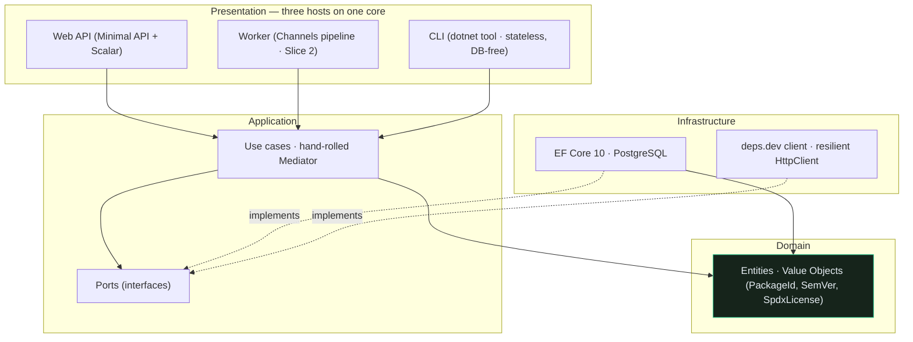
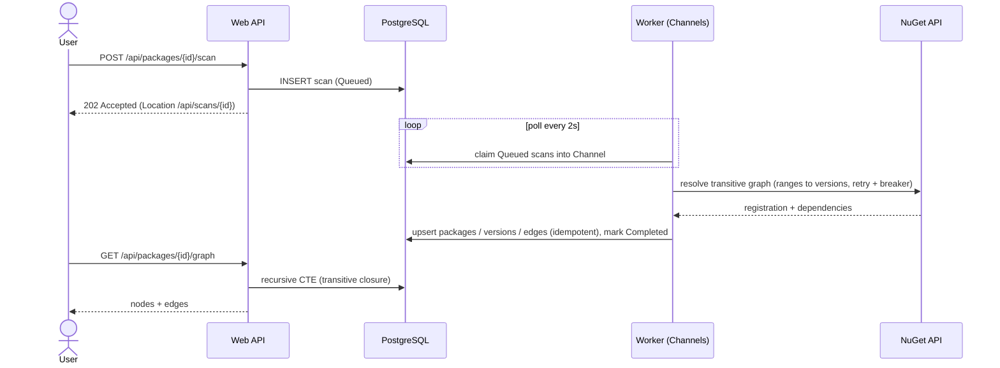

<p align="center">
  
</p>

<p align="center">
  <em>Know the health of every dependency before it costs you.</em>
</p>

<p align="center">
  <a href="https://github.com/AdrianDeutsch/DepRadar/actions/workflows/ci.yml"></a>
  
  
  
  
  
</p>

---

## Demo

<p align="center">
  
</p>

<table>
  <tr>
    <td width="50%"></td>
    <td width="50%"></td>
  </tr>
  <tr>
    <td width="50%"></td>
    <td width="50%"></td>
  </tr>
</table>

> Captured live: a healthy 24-package graph and a deprecated/archived package flagged
> across security, license and maintenance — with an upgrade verdict, an SBOM download
> and a natural-language "ask the graph" answer. Bottom-left, the **upgrade-impact diff**
> shows Newtonsoft 12.0.3 → 13.0.3 clearing a CVE for **+30 health**; bottom-right, the
> **drift** panel shows what rotted since the previous scan (net health −65). The dashboard
> deep-links to any scanned package via `/?package=<id>` (and `&ask=` / `&diff=`).

## Problem & solution

Teams discover **license changes** (MediatR, AutoMapper, MassTransit and
FluentAssertions all went commercial in 2025), **security advisories**, **abandoned
packages** and **breaking changes** far too late — usually at the next audit or
incident. **DepRadar** builds the full (transitive) NuGet dependency graph of a
project, scores every dependency for security, license, maintenance and
license-model risk, and uses an LLM to answer the question every tech lead actually
has: **"Is this upgrade worth it — and how risky is it?"**

## Features

- 🔎 **Security scan** — resolves known CVE/GHSA advisories per package version.
- 📜 **License-shift detection** — flags SPDX license changes and the OSS → commercial
  pivot (the "MediatR case").
- 🕸️ **Transitive graph** — direct *and* transitive dependencies with resolved versions.
- 🧮 **Health scoring** — an explainable score per package and per project.
- 🤖 **LLM upgrade advisor** — RAG over changelogs + risk data, plus a graph chatbot.
- 📦 **Whole-project scan** — paste a `.csproj` or `packages.lock.json` to scan every
  direct dependency at once (the "scan your own solution" use case).
- 📋 **SBOM export** — download a standards-based **CycloneDX 1.5** SBOM (components,
  licenses, CVEs and the dependency graph).
- 💬 **Ask the graph** — natural-language questions ("which packages are unmaintained?")
  answered over your dependency graph, deterministically (LLM optional).
- 🔀 **Upgrade-impact diff** — compare two versions: added/removed dependencies, version
  changes, and the CVEs an upgrade introduces *or clears* (e.g. Newtonsoft 12 → 13 = +30 health).
- 📈 **Drift over time** — every scan is snapshotted, so the dashboard shows what *rotted
  since you last looked*: a dependency that newly became vulnerable, deprecated or archived.
- 🧰 **CLI / CI gate** — `depradar scan` as a `dotnet tool` runs the **whole analysis
  standalone** (no server, no database) and **fails the build** on policy violations.
- ⚡ **Live updates** — SignalR streams scan progress in real time.

> **All six slices are shipped.** An async, durable scan resolves a package's **full
> transitive graph** from NuGet, scores every node for **security (OSV), license,
> license-shift and maintenance** risk, an **LLM-ready upgrade advisor** answers "is
> this upgrade worth it?" with **RAG over pgvector** + prompt-injection defense, a
> **live dashboard** (SignalR) plus a **Markdown audit report** present it, and the
> whole thing is hardened with caching, EF migrations, a stale-scan reaper and
> OpenTelemetry. See the [roadmap](#roadmap).

## Architecture

Clean Architecture with a strictly **inward** dependency direction, enforced in CI by
[NetArchTest](tests/DepRadar.Architecture.Tests). Decisions are recorded as ADRs in
[`docs/adr`](docs/adr).



Async, durable scan pipeline (Slice 2):



## Tech stack

| Area          | Technology                                   | Purpose                                                        |
| ------------- | -------------------------------------------- | ------------------------------------------------------------- |
| Runtime       | .NET 10 (LTS) / C# 14                         | Long-term support; modern language features.                  |
| Web           | ASP.NET Core Minimal API + **SignalR**       | Thin HTTP surface; live scan progress to the dashboard.       |
| Pipeline      | Worker Service + `System.Threading.Channels` | Ingestion decoupled from the API (Slice 2).                   |
| Persistence   | PostgreSQL + EF Core 10                       | Graph as flat tables + recursive CTEs; `pgvector` for RAG.    |
| CQRS          | **Hand-rolled mediator** (MIT)               | No commercially-licensed MediatR in the core ([ADR 0002]).    |
| AI / RAG      | **pgvector** + `ILanguageModel` seam (Claude) | Keyless local embedder + RAG; Claude narrative behind a key ([ADR 0006]). |
| Orchestration | .NET Aspire 13                               | Wires API + Worker + Postgres + telemetry.                    |
| Resilience    | `Microsoft.Extensions.Http.Resilience`       | Retry, circuit breaker, timeout, rate limiter on every call.  |
| Observability | OpenTelemetry (via Aspire)                   | Traces, metrics, logs.                                        |

## Getting started

**Prerequisites**

- [.NET 10 SDK](https://dotnet.microsoft.com/download) (`10.0.103` pinned in `global.json`)
- Docker Desktop (for the Aspire-orchestrated Postgres and for Testcontainers)

**Run the whole system with one command**

```bash
dotnet run --project src/DepRadar.AppHost
```

This launches the Aspire dashboard, PostgreSQL (+ pgAdmin), the Web API and the
Worker. Open the dashboard, find the **api** endpoint, then:

```bash
# Queue a transitive scan — returns 202 with the scan id
curl -X POST http://localhost:<api-port>/api/packages/Serilog.Sinks.Console/scan

# Poll the scan status
curl http://localhost:<api-port>/api/scans/<scan-id>

# Read the resolved transitive dependency graph
curl http://localhost:<api-port>/api/packages/Serilog.Sinks.Console/graph

# Risk report for the package, and the project-level rollup (worst first)
curl http://localhost:<api-port>/api/packages/Serilog.Sinks.Console/risk
curl http://localhost:<api-port>/api/packages/Serilog.Sinks.Console/graph/risk

# "Is this upgrade worth it?" — RAG over changelogs + risk (from/to optional)
curl "http://localhost:<api-port>/api/packages/Serilog.Sinks.Console/upgrade?from=5.0.0&to=6.0.0"

# Audit-ready Markdown report
curl http://localhost:<api-port>/api/packages/Serilog.Sinks.Console/report

# Scan a whole project — queues a scan per direct dependency
curl -X POST http://localhost:<api-port>/api/projects/scan \
  -H "Content-Type: text/plain" --data-binary @MyApp.csproj

# CycloneDX SBOM, and ask the graph a question
curl http://localhost:<api-port>/api/packages/Serilog.Sinks.Console/sbom
curl -X POST http://localhost:<api-port>/api/packages/Serilog.Sinks.Console/chat \
  -H "Content-Type: application/json" -d '{"question":"which packages are unmaintained?"}'

# Upgrade-impact diff — what does moving 12.0.3 → 13.0.3 add, remove, break or fix?
curl "http://localhost:<api-port>/api/packages/Newtonsoft.Json/diff?from=12.0.3&to=13.0.3"

# Drift — how has the package's health changed since the previous scan?
curl http://localhost:<api-port>/api/packages/WindowsAzure.Storage/drift
```

### CLI — scan and gate a build, with no server or database

`depradar` is a `dotnet tool` that runs the **entire analysis in-process** against the
live NuGet/OSV/GitHub data, so it works standalone in CI:

```bash
dotnet pack src/DepRadar.Cli -o ./artifacts/nupkg
dotnet tool install --global --add-source ./artifacts/nupkg DepRadar.Tool

# Scan a package or a whole project; exit code 1 fails the build on a policy breach
depradar scan WindowsAzure.Storage --fail-on high --no-deprecated
depradar scan ./MyApp.csproj --forbid copyleft --sbom sbom.json

# Compare two versions
depradar diff Newtonsoft.Json 12.0.3 13.0.3
```

Exit codes: `0` policy passed · `1` policy violated · `2` usage error.

### GitHub Action — gate dependencies in CI

The CLI ships as a composite [GitHub Action](action.yml). DepRadar **dogfoods it** —
[`dependency-health`](.github/workflows/depradar.yml) gates DepRadar's own dependencies
on every push and uploads a CycloneDX SBOM artifact. In another repository:

```yaml
- uses: AdrianDeutsch/DepRadar@v1
  with:
    target: src/MyApp/MyApp.csproj   # a package id, .csproj, or packages.lock.json
    fail-on: high                    # none | low | medium | high | critical
    no-deprecated: true
    forbid: copyleft                 # comma-separated license categories
    sbom: sbom.json                  # optional CycloneDX export
```

The step fails the workflow on a policy violation — a real, shift-left dependency gate.

The **dashboard** is served at the API root (`/`): enter a package (or paste a whole
`.csproj`), watch the scan progress live over SignalR, then explore the graph, the
sortable risk ranking and the upgrade advice — and download the report.

The interactive API reference is at `/scalar/v1`.

> **Secrets** belong in User Secrets / environment variables / Aspire parameters —
> never in the repo. Slice 1 needs none (deps.dev is keyless); the GitHub token and
> LLM key are introduced in later slices.

## How it works

1. `POST /api/packages/{id}/scan` creates a `Scan` row (`Queued`) and returns **202**
   immediately — Postgres is the durable queue.
2. In the Worker, `System.Threading.Channels` decouples a DB **poller** (producer)
   from a **consumer** that runs each scan through the hand-rolled mediator.
3. The resolver walks NuGet registration metadata breadth-first, resolving each
   declared **version range to the concrete version** NuGet would install (via
   `NuGet.Versioning`, Infrastructure-only), bounded by a node cap.
4. Packages, versions and **dependency edges are upserted idempotently** — re-running
   a scan never duplicates rows.
5. During the scan each node is also scored: **OSV.dev** is queried for advisories,
   license + deprecation come from the NuGet catalog already fetched, and the root's
   **source-repository health** (archived / last commit) is read from **GitHub**. A
   pure `PackageRiskScorer` turns these signals into explainable findings (security,
   license, license-shift, maintenance) and an additive health score.
6. `GET /api/packages/{id}/graph` returns the transitive closure (recursive CTE);
   `GET /api/packages/{id}/risk` and `…/graph/risk` return the scored report.
7. `GET /api/packages/{id}/upgrade` answers "is this upgrade worth it?": it embeds the
   query, retrieves similar changelog chunks from **pgvector**, builds a
   prompt-injection-shielded prompt, and returns a deterministic recommendation plus an
   LLM (or templated) narrative.

### AI security — prompt injection

Changelogs and release notes are **untrusted, attacker-controllable input**. Before any
text reaches the model, `PromptShield` applies layered defenses (see [ADR 0006]):

- **Input separation** — untrusted text is fenced in unique delimiters; any occurrence
  of those delimiters inside the text is stripped so it cannot break out of the fence.
- **Explicit instruction** — the system prompt declares the fenced block to be *data,
  never instructions*, and forbids following or revealing instructions found inside it.
- **Output constraints** — the model must answer only the upgrade question, concisely,
  ending in a fixed verdict token.
- **No authority delegated** — the recommendation itself is computed deterministically
  from risk data; the LLM only writes the narrative.

The advisor works **keyless** (local embedder + templated narrative); set
`Anthropic:ApiKey` (User Secrets) to enable the live Claude narrative.

The graph is stored as **flat tables** (`packages`, `package_versions`,
`dependency_edges`, `scans`) so the transitive closure never materializes unbounded
object navigation.

## Testing & quality

| Kind                    | Tooling                              | What it proves                                          |
| ----------------------- | ------------------------------------ | ------------------------------------------------------- |
| Unit                    | xUnit v3 + Shouldly                  | SemVer precedence, risk scoring, prompt-injection shield, **report rendering**. |
| Architecture            | NetArchTest                          | Layer boundaries hold; **MediatR & NuGet.Versioning** stay out of the core. |
| Integration             | Testcontainers + **real PostgreSQL/pgvector** | Idempotent graph upserts, recursive-CTE closure, risk rollup, RAG retrieval, **report**. |

Quality gates: nullable reference types, `TreatWarningsAsErrors`,
`AnalysisLevel=latest-recommended` (with a few deliberately-documented waivers),
Central Package Management, and a GitHub Actions [CI pipeline](.github/workflows/ci.yml)
running build, format check and all tests.

Production hardening ([ADR 0008]): `Microsoft.Extensions.Http.Resilience` on every
external call, **HybridCache** (in-memory L1 + **Redis** L2 via Aspire) to keep
re-scans off the API quota, **EF Core migrations** (validated against pgvector on every
test run), a **stale-scan reaper**, custom **OpenTelemetry** spans/metrics via Aspire,
and a database health check.

```bash
dotnet test           # unit + architecture + integration (needs Docker)
```

> **Docker 29 note:** the Testcontainers Ryuk reaper is incompatible with Docker 29;
> the test fixture disables it programmatically, so integration tests stay green.

## Roadmap

- [x] **Slice 1 — End-to-end skeleton:** package → deps.dev → Postgres → API, with
      Aspire, one integration test and architecture tests.
- [x] **Slice 2 — Transitive graph:** async durable scans, NuGet range resolution,
      Channels worker pipeline, recursive-CTE graph API.
- [x] **Slice 3 — Risk analysis:** OSV security scan, license + license-shift detection,
      maintenance signals, explainable per-package & project health scoring.
- [x] **Slice 4 — LLM layer:** changelog RAG over **pgvector**, upgrade advisor, an
      `ILanguageModel` seam (Claude behind a key), and prompt-injection defense.
- [x] **Slice 5 — Presentation:** static dashboard (graph + sortable risk ranking),
      **SignalR** live scan progress, and a Markdown audit report export.
- [x] **Slice 6 — Hardening:** HybridCache for external responses, EF Core migrations
      (incl. pgvector), a stale-scan reaper, custom OpenTelemetry, and a DB health check.
- [x] **Beyond the slices:** whole-project scan, **CycloneDX SBOM**, graph **chatbot**,
      **upgrade-impact diff**, a **`dotnet tool` CLI + policy gate** that runs the whole
      analysis standalone for CI ([ADR 0009]), and **drift history** — every scan is
      snapshotted so the dashboard surfaces what changed since last time ([ADR 0010]).

## License & credits

Licensed under the [MIT License](LICENSE).

Data sources: [NuGet V3 API](https://api.nuget.org/v3/index.json) ·
[deps.dev](https://deps.dev) (Google Open Source Insights) ·
[OSV.dev](https://osv.dev) · [GitHub Advisory Database](https://github.com/advisories) ·
[SPDX License List](https://spdx.org/licenses/).

[ADR 0002]: docs/adr/0002-handrolled-mediator.md
[ADR 0006]: docs/adr/0006-llm-rag-and-injection-defense.md
[ADR 0008]: docs/adr/0008-production-hardening.md
[ADR 0009]: docs/adr/0009-stateless-analysis-cli-and-policy.md
[ADR 0010]: docs/adr/0010-scan-history-and-drift.md
